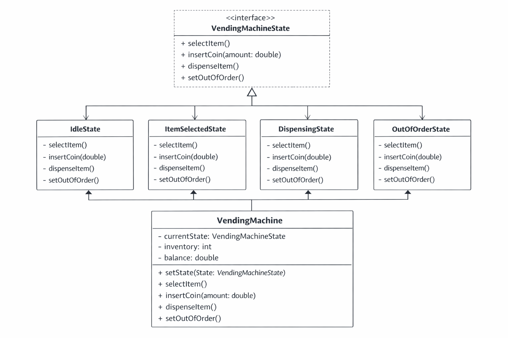

# Vending-Machine
📌 Problem Scenario

A vending machine must handle different operational states:

Idle

ItemSelected

Dispensing

OutOfOrder

Each state has its own allowed and restricted actions.
The current implementation uses many if-else or switch conditions inside the VendingMachine class, making it hard to maintain and extend.

To improve maintainability and flexibility, we apply the State Design Pattern by:

Creating separate classes for each state

Defining a common state interface

Delegating behavior to the current state object

Removing conditional state logic from the main class

